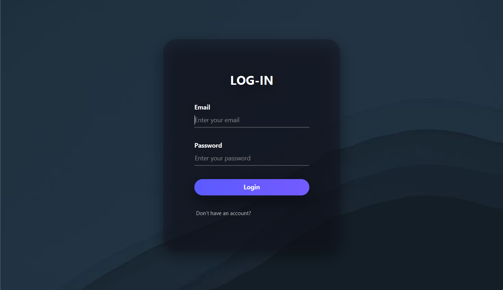

# 🎓 Collaborative Study Platform

**Collaborative Study Platform** is a desktop client-server application designed to organize the learning process, manage study groups, tasks, and shared resources.

This project was developed as a semester coursework assignment.



## 🚀 Key Features

* **🔐 Authentication & Security:** Secure User Registration and Login using **JWT (JSON Web Tokens)**. Passwords are hashed using BCrypt.
* **👥 Group Management:** Create, edit, and delete study groups. Invite members via email.
* **📋 Task Management:** Create tasks, set deadlines, and track status (`OPEN` -> `IN_PROGRESS` -> `DONE`).
* **📚 Shared Resources:** Upload links and references for specific groups.
* **🔔 Real-time Notifications:** Instant popup notifications (Custom Toasts) for new tasks, members, and resources (powered by **WebSockets/STOMP**).
* **📊 Statistics:** Visual representation of task progress (Pie Chart) per group.
* **📜 Activity Log:** Comprehensive audit trail of user actions.
* **👤 User Profile:** Edit user details (Name, Email).
* **🗑 Data Integrity:** Implemented cascading delete (Deleting a group automatically removes all associated tasks, resources, and memberships).

---

## 🛠 Technology Stack

### Backend (Server)
* **Java 25**
* **Spring Boot 3.x** (Web, Security, Data JPA, WebSocket)
* **Database:** SQLite (`study_platform.db`)
* **ORM:** Hibernate
* **Security:** Spring Security + JJWT

### Frontend (Client)
* **JavaFX** (UI Framework)
* **Maven** (Dependency & Build Management)
* **Java 25 HttpClient** (REST API requests)
* **Gson** (JSON parsing)
* **CSS** (Custom Dark Theme Styling)

---

## ⚙️ Setup and Execution

### Prerequisites
* **JDK 25** installed.
* **IntelliJ IDEA** (Recommended).

### 1. Running the Backend (Server)
1.  Open the project in IntelliJ IDEA.
2.  Navigate to the `backend` module.
3.  Locate the main class: `com.proj.backend.PlatformStudyApplication`.
4.  Click the **Green Play Button** (Run) next to the class name or method.
    * The server will start on **port 8080**.
    * *Note: The database file will be automatically created in `web_app/databases/`.*

### 2. Running the Frontend (Client)
⚠️ **Important:** Running JavaFX applications requires correct module paths. The easiest way is using the Maven Run Configuration in IDEA.

**Option A: Using Maven Panel (Recommended)**
1.  Open the **Maven** tab on the right side of IntelliJ IDEA.
2.  Expand: `frontend` -> `Plugins` -> `javafx`.
3.  Double-click on **`javafx:run`**.
    * This ensures all JavaFX dependencies are loaded correctly.

**Option B: Using Application Run Configuration**
1.  Locate the main class: `com.proj.frontend.App`.
2.  Click the **Green Play Button** (Run).
    * *If you get a "JavaFX runtime components are missing" error, please use Option A.*

---

## 🧪 Testing Real-Time Features

To test WebSockets and Notifications:
1.  Start the **Backend**.
2.  Run **two instances** of the Frontend application (open two terminals and run `mvn javafx:run` in both).
3.  Log in with **User A** in the first window and **User B** in the second.
4.  User A creates a new Task in a shared group.
5.  User B will immediately receive a **popup notification** 🔔 without refreshing the page.

---

## 🗄 Database Schema

The application uses **SQLite** with the following relational structure:

* **Users:** Stores login credentials (hashed) and profile info.
* **Groups:** Study groups created by users.
* **Memberships:** Links Users to Groups (Roles: ADMIN, MEMBER).
* **Tasks:** Assignments linked to a specific Group.
* **Resources:** Learning materials linked to a specific Group.
* **ActivityLogs:** Stores history of actions for audit.

---

## 📂 Project Structure

```text
web_app/
├── backend/             # Spring Boot Application
│   ├── src/main/java/com/proj/backend/
│   │   ├── config/      # Security & WebSocket configs
│   │   ├── controller/  # REST Endpoints
│   │   ├── model/       # DB Entities
│   │   ├── service/     # Business Logic
│   └── src/main/resources/
│       └── application.properties
│
├── frontend/            # JavaFX Application
│   ├── src/main/java/com/proj/frontend/
│   │   ├── controller/  # UI Logic
│   │   ├── model/       # Data Models
│   │   ├── service/     # API & WebSocket Clients
│   │   └── util/        # Notification Helpers
│   └── src/main/resources/
│       ├── fxml/        # Views
│       ├── css/         # Styles
│
└── databases/           # SQLite Database location
